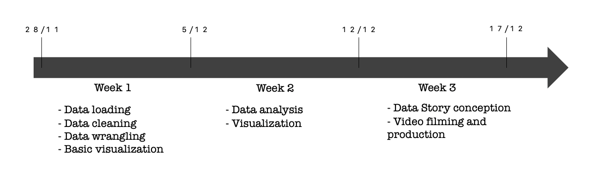

# ada-2020-project-milestone-p3-p3_yo-banana-boy

### **|| Title**  
What can we learn from Wikipedia adminship elections? How social network structure potentially influences voting in a time-dependent manner: analysis of a signed social network

### **|| Abstract**  
The main idea behind our project proposal is to extend the signed social network analysis to the time domain. We believe that the Wikipedia dataset has not been analysed to its full extent by the authors and thus want to take advantage of the so far unused information in this dataset to determine amongst others temporal dynamics and patterns in adminship elections. Staying in the field of social networks and theories, we also want to find out if we can confirm or refute specific social theories such as herding behaviour on this dataset where votes were public during elections. The goal is thus to get a deeper overview of temporal influence on social networks and especially on election outcomes. Our findings might later on be extended and tested on other datasets from other signed networks to reach a full understanding of the influence of public voting models on election outcomes. 

### **|| Research Questions**  
The main focus of our research will be on temporal analysis of Wikipedia adminship elections.

- What can we learn about the temporal dynamics of the elections?
- Does the date of an election correlate with its outcome? Can one identify temporal patterns, i.e., are some time periods more favourable than others for someone to be elected?
- Do elections display specific time-dependent distributions of the votes? Are these distributions significantly different between successful and unsuccessful elections? If so, how do they differ?
- Can we identify any social theories, that would (partially) explain the proportion of positive votes over time, for a given election? For instance, is there evidence of an induced herding behavior?

Let’s note that these questions merely attempt to decipher correlations and not causal relationships.

Some other aspects also being investigated are:
- What role do neutral votes play in this temporal analysis?
- What are the specificities in terms of the vote distribution for repeated elections? By repeated election, we mean that the same candidate seeked adminship several times.

Related work without precise analysis of the observed time patterns for Wikipedia adminship elections can be found in the following preserver published [article](https://arxiv.org/abs/1004.3547). 

### **|| Proposed dataset**
Wikielec dataset from the replicated paper. 
This dataset contains the information about all elections for Wikipedia administrators that happened between 2004-09-14 and 2008-01-06, including : 
- The Election outcome (promotion as an admin or not)
- The time each election was closed
- Candidates’ ID on the Wikipedia platform
- The voters’ ID and their respective votes value for each of the elections they participated in (1:support, 0:neutral, -1:oppose)
The dataset shares these previous pieces of information about 2.800 elections, cumulating a total of around 100’000 votes, and about 7’000 users (voters and candidates). 

### **|| Methods** 
**Data collection:**
Download the dataset provided for the replication analysis.
https://snap.stanford.edu/data/wiki-Vote.html

**Data parsing and cleaning**
The dataset needs to be parsed in order to obtain information organized in a clear pattern that will facilitate its utilization.  
We want to obtain a dataframe showcasing the following columns : 

‘Voter’ / ‘Candidate’ / ‘ Value of the vote’ / ‘Time of the election’ / ‘Time at which the election was closed’ / ‘Outcome of the election’

From this, we will be able to build a directed graph (using the networkx python library). Each node will be a user (either a voter or a candidate), the edges will correspond to the voting relations between users, their attribute being the sign of the vote (-1;0;1). 

**Temporal analysis:**

*Time correlation* : We will try to detect any pattern of the elections’ outcomes based on the moment that they were held. We will use mainly visualizations under the form of graphs, by plotting outcomes vs particular time periods (e.g. years, months..) . 

*Time dependence of each election:* We will then be interested in the influence of the duration on the proceeding of each election. Using the closing time of each election and the time at which each vote was casted, we will again try to detect patterns. For example, if most of the votes happened at the beginning of one election, can it give clues on what the outcome will be? Compared to a situation where votes were casted roughly uniformly from beginning to end of the election? 

*Social theories* : We will focus on social theories that could correlate with the time patterns that we observed. One example is the herding behavior : if many users begin voting for one candidate, can we see a progressive increase in the number of the votes? Can voters attract voters? 

The herding phenomenon has also been investigated in this article. https://dlab.epfl.ch/people/west/pub/Lederrey-West_WWW-18.pdf
We will mainly use visualization to decipher potential relationships between time and election outcome / proportion of positive votes using Matplotlib library / seaborn library.
Importantly, we will group by various time periods -- using pandas.Grouper -- to find potential temporal patterns.
When possible, we will estimate our error by displaying (bootstraped) confidence intervals.
Finally, we’ll use a 2D dynamic plot to follow election statistics. 

### **|| Proposed Timeline** 
Week 1: 27/11 - 04/12
Data loading, Data cleaning, Data wrangling, basic visualization to get a sense of the dataset (search for abnormalities in the dataset: check variables’ types, values, distribution).
Start the data analysis: temporal analysis and side research, as described above
Get more familiar with the different social theories that we could use for our analysis.

Week 2: 04/12 - 11/12
Continue the data analysis and visualize the obtained results.
Produce a fine visualization to depict the vote fluctuations in time, and potentially identify election outcome-dependent trends. 
Use the previous results and apply our findings to the social theories that we chose during week 1. 
Start diving into the world of interactive websites and learn how to produce a short video.

Week 3: 11/12 - 18/12
Communication of our results. 
Design the website to tell our data story and start producing a concise video presenting our key findings.

### **|| Organization within the team** 
*Eugénie:*
Data loading, Data cleaning, Data wrangling in week 1.
Communication chief: 
Learn how to produce state-of-the-art, interactive website, in week 2.
Design the website to tell our data story and start producing a concise video presenting our key findings, in week 3.

*Niko:* 
Temporal analysis. In week 1, start the analysis. In week 2, produce visualization to depict the votes fluctuations in time, and potentially identify election outcome-dependant trends (with Camille).
At the service of Eugénie in week 3.

*Camille:*
Social theories detections and analysis. In week 1, start the analysis. In week 2, work with Niko on the visualizations.
At the service of Eugénie in week 3.

### **|| Questions for TAs (optional)**
Do the research questions seem reasonable to you? 
Do you have any libraries that you would recommend for interactive visualizations?
